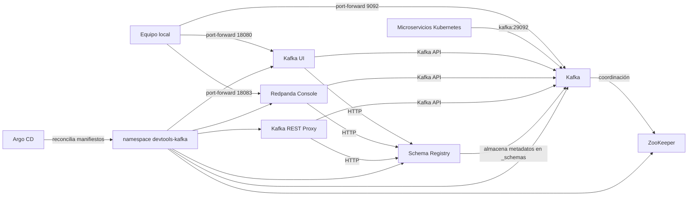

# Plataforma Kafka local administrada con Argo CD

## Introducción

Este repositorio despliega una plataforma Kafka completa dentro del clúster
Kubernetes local `kind-hello-world`. El objetivo es disponer de un entorno de
desarrollo reproducible donde los microservicios puedan publicar y consumir
eventos, registrar contratos de datos y observar el sistema mediante dos
interfaces web.

La plataforma vive en el namespace `devtools-kafka` y está compuesta por:

| Componente | Función | Servicio interno |
| --- | --- | --- |
| ZooKeeper | Mantiene la coordinación y los metadatos requeridos por esta versión de Kafka | `zookeeper:2181` |
| Kafka | Broker que almacena y distribuye los eventos | `kafka:29092` |
| Schema Registry | Gestiona las versiones y la compatibilidad de los contratos | `http://schema-registry:8081` |
| Kafka REST Proxy | Permite trabajar con Kafka mediante HTTP | `http://rest-proxy:8082` |
| Kafka UI | Interfaz para brokers, topics, mensajes, consumidores, esquemas y ZooKeeper | `http://kafka-ui:8080` |
| Redpanda Console | Segunda interfaz para explorar topics, mensajes, consumidores y esquemas | `http://redpanda-console:8080` |

Aunque se utiliza Redpanda Console como interfaz, el broker desplegado sigue
siendo Apache Kafka de la distribución Confluent. Console es compatible con la
API de Kafka y no convierte el clúster en Redpanda.

## Arquitectura



Todo el tráfico entre componentes usa los nombres DNS de los Services de
Kubernetes. Como todos están en el mismo namespace, basta con usar nombres
cortos como `kafka`, `schema-registry` y `zookeeper`. Desde otro namespace se
pueden utilizar las direcciones completas:

```text
kafka.devtools-kafka.svc.cluster.local:29092
schema-registry.devtools-kafka.svc.cluster.local:8081
```

## Kafka y sus listeners

El broker utiliza la imagen `confluentinc/cp-kafka:7.4.4` y tiene dos
listeners PLAINTEXT:

- `PLAINTEXT://kafka:29092`: listener interno anunciado a los pods del clúster.
- `PLAINTEXT_HOST://localhost:9092`: listener pensado para un `port-forward`
  desde el equipo local.

Esta separación es importante. Un cliente de Kafka no conserva únicamente la
dirección inicial o *bootstrap server*: después de conectar, recibe del broker
la dirección anunciada que debe usar en las conexiones posteriores. Por ello,
los pods usan `kafka:29092`, mientras que una aplicación ejecutada directamente
en el equipo usa `localhost:9092` con el túnel activo.

La instalación tiene un solo broker y configura en `1` el factor de réplica de
los offsets y de las transacciones. También permite crear topics
automáticamente. Son decisiones apropiadas para desarrollo local, pero no para
alta disponibilidad.

## El papel de ZooKeeper

Esta configuración de Kafka todavía funciona en modo ZooKeeper. El broker se
conecta a `zookeeper:2181` mediante `KAFKA_ZOOKEEPER_CONNECT`. ZooKeeper se
encarga de la coordinación que necesita esta generación del broker.

Kafka UI recibe también `zookeeper:2181`, por lo que puede presentar la
información relacionada con esa conexión. Redpanda Console no consulta
ZooKeeper directamente: utiliza la API estándar de Kafka y Schema Registry.
Esto es normal y no impide que muestre topics, particiones, mensajes o grupos
de consumidores del broker respaldado por ZooKeeper.

En una evolución futura se podría migrar Kafka a KRaft, que elimina la
dependencia de ZooKeeper. Esa migración cambiaría la configuración del broker y
no debería hacerse como una simple eliminación del Deployment de ZooKeeper.

## Schema Registry y contratos

Schema Registry expone una API HTTP en el puerto `8081` y almacena sus datos en
el topic interno `_schemas`. El broker utilizado por el registro es
`kafka:29092`.

Al finalizar cada sincronización, Argo CD ejecuta el hook PostSync
`register-demo-schemas`. El Job espera hasta que Schema Registry responda y
registra estos subjects:

- `test-topic-key`: clave de tipo string.
- `test-topic-value`: registro `DemoValue` con un entero `id` y un string
  `message`.

El esquema permite que productores y consumidores compartan un contrato
versionado. En lugar de asumir informalmente la forma del mensaje, las
aplicaciones pueden serializarlo con un identificador de esquema y validar su
compatibilidad durante la evolución del contrato.

Para consultar los subjects desde el equipo local:

```powershell
kubectl port-forward -n devtools-kafka svc/schema-registry 18081:8081
Invoke-RestMethod http://localhost:18081/subjects
```

## Kafka REST Proxy

REST Proxy traduce peticiones HTTP a operaciones de Kafka. Está conectado al
broker `kafka:29092` y a Schema Registry. Resulta útil para pruebas, scripts o
clientes que no incorporan una librería Kafka nativa.

Acceso temporal:

```powershell
kubectl port-forward -n devtools-kafka svc/rest-proxy 18082:8082
Invoke-RestMethod http://localhost:18082/topics
```

Para aplicaciones de producción suele ser preferible un cliente Kafka nativo,
ya que ofrece más control sobre particiones, confirmaciones, reintentos,
consumidores y rendimiento.

## Kafka UI

Kafka UI utiliza la imagen `provectuslabs/kafka-ui:v0.7.2`. Su clúster se llama
`devtools-kafka` y está configurado de forma declarativa con:

```text
Kafka:           kafka:29092
Schema Registry: http://schema-registry:8081
ZooKeeper:       zookeeper:2181
```

`DYNAMIC_CONFIG_ENABLED=false` impide que cambios realizados desde la interfaz
se conviertan en una configuración local efímera del contenedor. La fuente de
verdad continúa siendo Git.

Desde Kafka UI se pueden inspeccionar, entre otros elementos:

- El estado del broker y su versión.
- Topics, particiones, réplicas y offsets.
- Mensajes, claves, cabeceras y marcas de tiempo.
- Grupos de consumidores y su retraso o *consumer lag*.
- Subjects y versiones de Schema Registry.

## Redpanda Console

Redpanda Console utiliza la imagen
`docker.redpanda.com/redpandadata/console:v3.11.0`. Se conecta mediante estas
variables:

```text
KAFKA_BROKERS=kafka:29092
SCHEMAREGISTRY_ENABLED=true
SCHEMAREGISTRY_URLS=http://schema-registry:8081
```

Ofrece una segunda vista del mismo clúster. Es especialmente práctica para
explorar mensajes, observar grupos de consumidores y comprobar cómo Schema
Registry deserializa los datos. No se ha configurado una Admin API de Redpanda
porque el broker real es Kafka y esa API no existe en este despliegue.

Tener dos interfaces no duplica los datos ni crea dos clústeres: ambas son
clientes sin estado que consultan los mismos servicios internos.

## Despliegue GitOps con Argo CD

La Application `devtools-kafka` apunta a
`manifests/devtools-kafka` en la rama observada del repositorio. Tiene activadas
la sincronización automática, la autocorrección y la poda:

- `automated`: aplica automáticamente las revisiones nuevas.
- `selfHeal`: revierte cambios manuales que difieran de Git.
- `prune`: elimina recursos que hayan sido retirados de los manifiestos.
- `CreateNamespace=true`: permite crear el namespace de destino.

Los *sync waves* establecen el orden de arranque:

| Wave | Recursos |
| ---: | --- |
| `-1` | Namespace `devtools-kafka` |
| `0` | ZooKeeper |
| `1` | Kafka |
| `2` | Schema Registry |
| `3` | REST Proxy, Kafka UI y Redpanda Console |
| `4` | Job PostSync que registra los esquemas demo |

Argo CD espera que una wave esté sana antes de avanzar. Así se evita iniciar
Schema Registry sin Kafka o ejecutar el registro de contratos antes de que su
API esté disponible.

El flujo habitual de una modificación es:

1. Se modifica un manifiesto en Git.
2. El cambio se valida y se publica en el repositorio remoto.
3. Argo CD detecta la nueva revisión.
4. El controlador compara el estado deseado con el estado real.
5. Argo CD aplica solo las diferencias y comprueba la salud de cada recurso.

Estado de la Application:

```powershell
kubectl get application devtools-kafka -n argocd
kubectl get pods,svc -n devtools-kafka
```

Los estados esperados son `Synced` y `Healthy`.

## Acceso a las interfaces desde el equipo local

Los Services son de tipo `ClusterIP`; no quedan expuestos permanentemente
fuera de Kubernetes. Para acceder a ellos se crean túneles temporales. Ejecuta
cada comando en una terminal distinta:

```powershell
kubectl port-forward -n devtools-kafka svc/kafka-ui 18080:8080
kubectl port-forward -n devtools-kafka svc/redpanda-console 18083:8080
```

Después abre:

- Kafka UI: `http://localhost:18080`
- Redpanda Console: `http://localhost:18083`

El túnel existe mientras el proceso `kubectl` continúe activo. Si se ejecuta en
primer plano, se detiene con `Ctrl+C`.

Otros túneles útiles son:

```powershell
kubectl port-forward -n devtools-kafka svc/kafka 9092:9092
kubectl port-forward -n devtools-kafka svc/schema-registry 18081:8081
kubectl port-forward -n devtools-kafka svc/rest-proxy 18082:8082
```

## Comprobaciones operativas

### Estado general

```powershell
kubectl get pods,deployments,svc -n devtools-kafka
kubectl get application devtools-kafka -n argocd
```

Todos los Deployments deben mostrar una réplica disponible. El Job
`register-demo-schemas` debe aparecer como `Completed`; no es un servicio que
deba permanecer ejecutándose.

### Logs

```powershell
kubectl logs -n devtools-kafka deployment/kafka
kubectl logs -n devtools-kafka deployment/schema-registry
kubectl logs -n devtools-kafka deployment/kafka-ui
kubectl logs -n devtools-kafka deployment/redpanda-console
```

Para seguir los logs en tiempo real se añade `-f`.

### Salud HTTP

Con los túneles activos:

```powershell
Invoke-RestMethod http://localhost:18080/actuator/health
Invoke-RestMethod http://localhost:18083/admin/health
Invoke-RestMethod http://localhost:18081/subjects
```

Kafka UI debe devolver `UP`, Redpanda Console debe indicar que HTTP está sano y
Schema Registry debe listar los dos subjects de demostración.

### Diagnóstico de un pod

```powershell
kubectl describe pod -n devtools-kafka -l app.kubernetes.io/name=kafka-ui
kubectl get events -n devtools-kafka --sort-by=.lastTimestamp
```

`describe` muestra fallos de imagen, configuración, permisos o probes. Los
eventos ayudan a distinguir un error de la aplicación de un problema de
planificación o descarga de imágenes.

## Seguridad y salud de los contenedores

Los contenedores se ejecutan como usuarios no-root, usan el perfil seccomp
`RuntimeDefault`, no permiten elevar privilegios y eliminan todas las
capabilities Linux. Kafka UI y Redpanda Console fijan explícitamente el UID 100
y el GID 101 porque sus imágenes declaran usuarios por nombre y Kubernetes
necesita un identificador numérico para verificar `runAsNonRoot`.

Cada Deployment define:

- Una `readinessProbe`, que decide cuándo el pod puede recibir tráfico.
- Una `livenessProbe`, que permite reiniciar un proceso bloqueado.
- Requests de CPU y memoria para la planificación.
- Límites para impedir que una herramienta consuma todos los recursos del nodo.

## Límites del entorno actual

Esta plataforma está orientada al desarrollo local. Antes de usar un diseño
similar en producción habría que revisar como mínimo:

- Kafka tiene un solo broker y no ofrece tolerancia a la pérdida del nodo.
- Los factores de réplica están configurados en `1`.
- No hay volúmenes persistentes; un pod recreado puede perder datos locales.
- Las conexiones usan PLAINTEXT, sin TLS ni SASL.
- Las interfaces web no tienen autenticación configurada.
- Los `port-forward` son accesos temporales, no un mecanismo de publicación.
- ZooKeeper supone una arquitectura anterior a KRaft.
- No hay NetworkPolicies que limiten qué pods pueden alcanzar la plataforma.

Para producción serían necesarios almacenamiento persistente, varios brokers,
replicación, autenticación, cifrado, autorización, copias de seguridad,
monitorización, alertas y una estrategia explícita de actualización.

## Archivos principales

- `applications/devtools-kafka.yaml`: definición de la Application de Argo CD.
- `manifests/devtools-kafka/kustomization.yaml`: inventario de recursos.
- `manifests/devtools-kafka/zookeeper.yaml`: coordinación del broker.
- `manifests/devtools-kafka/kafka.yaml`: listeners y configuración de Kafka.
- `manifests/devtools-kafka/schema-registry.yaml`: servicio de contratos.
- `manifests/devtools-kafka/rest-proxy.yaml`: API REST de Kafka.
- `manifests/devtools-kafka/kafka-ui.yaml`: primera interfaz visual.
- `manifests/devtools-kafka/redpanda-console.yaml`: segunda interfaz visual.
- `manifests/devtools-kafka/schema-registrar.yaml`: registro PostSync de esquemas.

Con esta separación, Git conserva la descripción completa de la plataforma y
Argo CD mantiene el clúster alineado con ella de forma automática.
